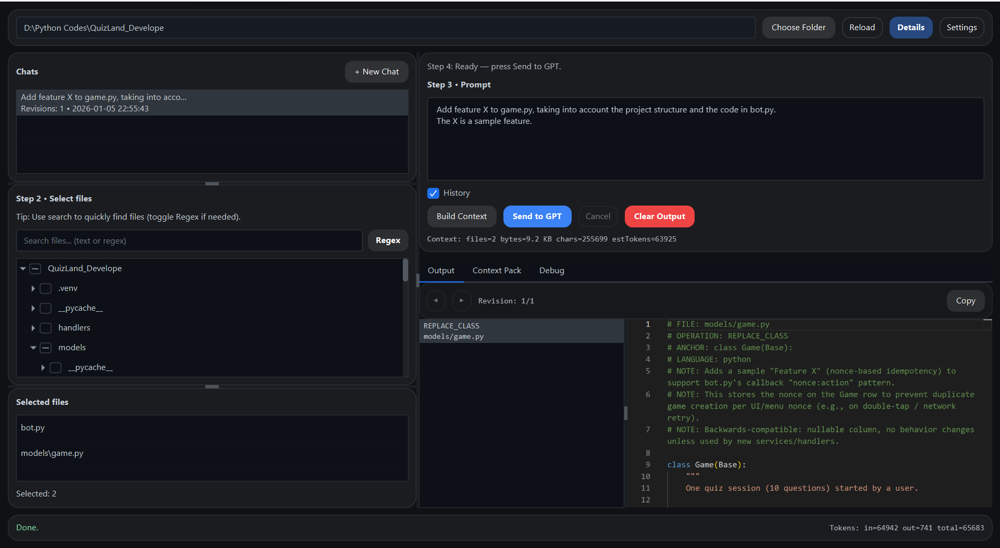

Below is a **semi-formal, GitHub-ready README** written based on the full project source you provided .
You can copy this directly into `README.md`.

---

# GPT-Agent

**GPT-Agent** is a local desktop application (JavaFX) that helps developers work with large codebases when interacting with OpenAI models.
It builds a **structured, reproducible context pack** from selected project files, sends it to GPT, and presents the AI’s response as **actionable change blocks** with a rich code viewer.

Think of it as a **developer-oriented GPT companion** for reviewing, modifying, and generating code with full context awareness.

---

## ✨ Key Features

* **Local-first desktop app** (no cloud sync, no telemetry)
* **Project-aware context builder**

    * Scans a project directory
    * Ignores binaries, build outputs, and common noise
    * Lets you select exactly which files go into the prompt
* **Structured “Context Pack” generation**

    * Project tree snapshot
    * Selected file contents (with size limits & binary detection)
    * Optional recent chat history
* **Chat-based workflow**

    * Multiple chats stored locally
    * Revision history per chat
    * Navigate back and forth between AI responses
* **Actionable AI output**

    * Parses GPT responses into structured change blocks
    * Supports legacy and snippet-based formats
    * Falls back gracefully to raw output
* **Embedded Monaco Editor**

    * Read-only, syntax-highlighted code preview
    * Responsive resizing
    * Copy selection or full output
* **Advanced debugging tools**

    * Inspect raw request sent to OpenAI
    * Inspect raw response
    * Token usage estimates
* **Modern UI**

    * Dark theme (Atlantafx / Primer)
    * Regex-enabled file search
    * Progressive disclosure (“Details” mode)

---

## 🧠 How It Works (High Level)

1. **Select a project folder**
2. **Pick relevant files** from the tree (with search & regex)
3. **Write a precise prompt**
4. GPT-Agent builds a **Context Pack**:

    * Project structure
    * Selected file contents
    * Prompt + optional chat history
5. The Context Pack is sent to OpenAI’s Responses API
6. The response is:

    * Parsed into structured change blocks (if possible)
    * Displayed in Monaco for review & copying
7. Everything is saved **locally** for reproducibility

---

## 🖥️ Screens & UI Highlights

* project tree + file selection
* prompt & chat management
* output blocks + Monaco viewer
* Tabs:

    * **Output** – parsed AI response
    * **Context Pack** – exact payload sent to GPT
    * **Debug** (optional) – raw request/response


---

## 🚀 Getting Started

### Prerequisites

* **Java 24** (via toolchain)
* **Gradle Wrapper** (included)
* Internet access for OpenAI API calls

### Clone & Run

```bash
git clone https://github.com/your-username/GPT-Agent.git
cd GPT-Agent
./gradlew run
```

On Windows:

```bat
gradlew.bat run
```

---

## 🔑 OpenAI Configuration

On first launch, open **Settings** and provide:

* **API Key**
* **Model name** (default: `gpt-4.1`)

Configuration is stored locally at:

```text
~/.gpt-agent/config.properties
```

You can also use environment variables:

```bash
OPENAI_API_KEY=sk-...
OPENAI_MODEL=gpt-4.1
```

---

## 📂 Project Structure (Simplified)

```text
GPT-Agent/
├─ src/main/java/com/QM4RS/agent
│  ├─ core/        # Context building, parsing, OpenAI logic
│  ├─ ui/          # JavaFX UI & Monaco integration
│  ├─ MainApp.java
│  └─ Launcher.java
├─ src/main/resources/monaco/
│  └─ monaco.html
├─ build.gradle.kts
└─ settings.gradle.kts
```

---

## 🧩 Output Formats Supported

GPT-Agent can parse AI responses into structured blocks when the model follows certain conventions:

* **Legacy format** (`CHANGE:` / `code:`)
* **Snippet format** with comment headers:

    * `FILE:`
    * `OPERATION:`
    * `ANCHOR:`
    * `LANGUAGE:`

If parsing fails, the response is still preserved as **RAW output**.

---

## 🧪 Status & Maturity

* ✅ Actively usable
* ⚠️ No automatic code application (manual copy/paste by design)
* ⚠️ No sandbox execution of AI-generated code

This is a **developer tool**, not an autopilot.

---

## 🛣️ Possible Future Improvements

* Diff view against local files
* Apply changes directly (opt-in)
* Prompt templates per language/framework
* Model presets & cost controls
* Cross-platform packaging (jpackage)

---

## 🔒 Privacy & Safety

* All chats and configs are stored **locally**
* No telemetry
* No background network activity
* OpenAI requests are explicit and visible (Debug tab)

---

## 📄 License

* MIT License (simple & permissive)
---

## 🙌 Final Notes

GPT-Agent is built for developers who want:

* Full control over context
* Transparency in AI requests
* A serious, inspectable workflow

If you use GPT heavily on real-world codebases, this tool is meant for you.

---

If you want, next we can:

* Tighten this README for **open-source launch**
* Add badges (Java, JavaFX, OpenAI, Gradle)
* Write a short **GitHub repo description**
* Pick a clean **license** and add `LICENSE` file
